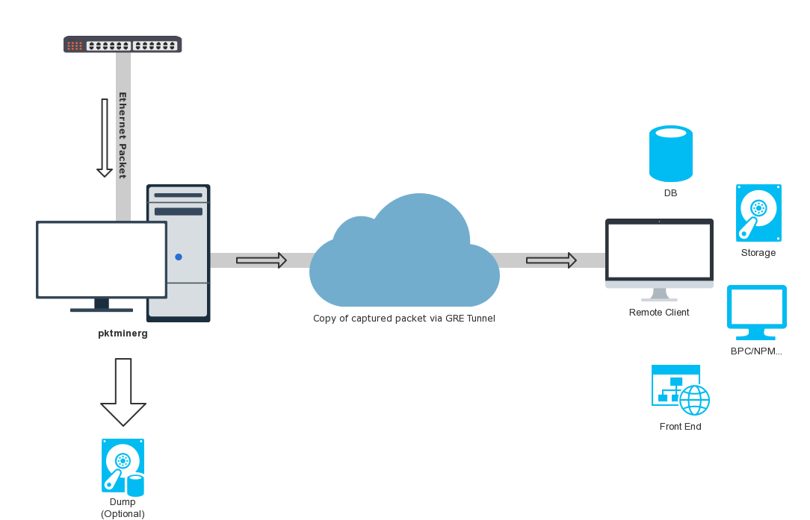
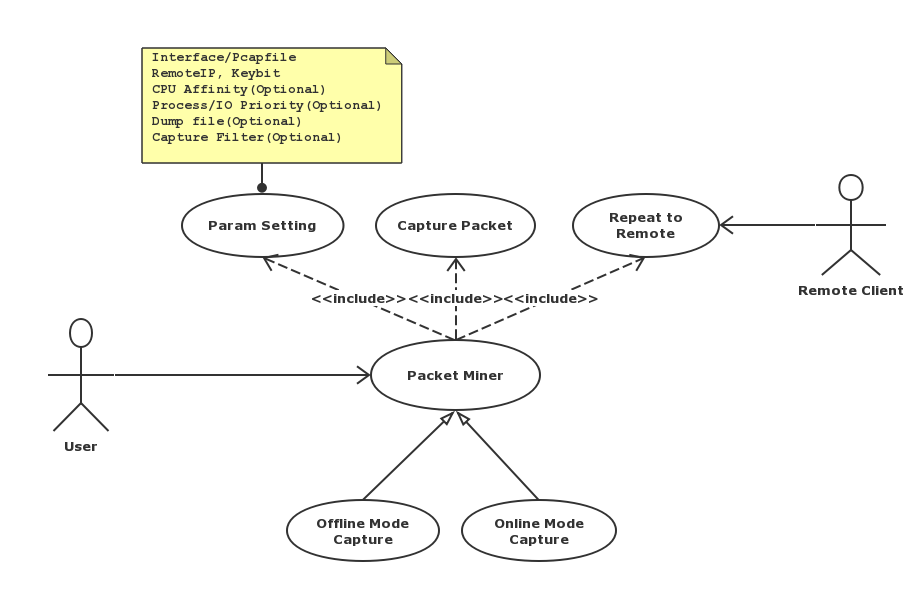

[English](README.md)  ∙  简体中文


# Netis Packet Agent 0.3.2

[](https://github.com/Netis/packet-agent/releases/tag/0.3.2)
[](./LICENSE.md)


## 什么是Netis Packet Agent?
Netis Packet Agent是一个用于解决如下问题的开源项目：设备A上抓取的数据包，之后在设备B上使用分析。在很多时候，当你希望监控网络的流量，但是并没有可用的设备，例如：
- 物理环境中不存在[TAP](https://en.wikipedia.org/wiki/Network_tap)和[SPAN](http://docwiki.cisco.com/wiki/Internetworking_Terms:_Switched_Port_Analyzer_(SPAN))设备。
- 虚拟环境中，Virtual Switch [Flow Table](https://wiki.openstack.org/wiki/Ovs-flow-logic)不支持SPAN功能。

因此，该项目提供一套低开销但是高性能的抓包工具，用于应对上述困难。
- **pktminerg**是第一个发布的工具。该工具可以轻松地在网卡上抓数据包，用GRE头进行封装并发送到远端的设备，来进行数据包监控和分析。



此外，还有另外3个工具：
- **pcapcompare**用于比较两个pcap文件
- **gredump**根据特定的过滤规则抓取GRE数据包，并存储为pcap文件。
- **gredemo**是一个demo应用程序，可以从pcap文件读取数据包，然后把它们发送到远端网卡。这个程序只能通过源代码编译生成。

## 开始
### 安装

#### CentOS 6/7和RedHat 7
1. 安装libpcap和wget
```bash
yum install libpcap wget
```

2. 下载并安装RPM包。您可以从[这个地址](https://github.com/Netis/packet-agent/releases)获取最新版本的软件包。
```bash
wget https://github.com/Netis/packet-agent/releases/download/v0.3.2/netis-packet-agent-0.3.2.el6.x86_64.rpm
rpm -ivh netis-packet-agent-0.3.2.el6.x86_64.rpm
```
#### SUSE12
1. 下载并安装RPM包。您可以从[这个地址](https://github.com/Netis/packet-agent/releases)获取最新版本的软件包。
```bash
wget https://github.com/Netis/packet-agent/releases/download/v0.3.2/netis-packet-agent-0.3.2.el6.x86_64.rpm
rpm -ivh netis-packet-agent-0.3.2.el6.x86_64.rpm
```

** 如果安装过程中提示libboost库的版本号不正确，请下载安装boost_1_59_0或者之后的版本。如果问题依然无法解决，可以尝试从源代码直接编译安装。<br/>
** 现在仅支持 CentOS 6/7版本和RedHat 7版本

#### Windows 7/8/10 x64
1. 下载并安装[WinPcap](https://www.winpcap.org/install/bin/WinPcap_4_1_3.exe)
2. 下载并安装[Microsoft Visual C++ Redistributable for Visual Studio 2017 x64](https://aka.ms/vs/15/release/vc_redist.x64.exe)
3. 从zip文件解压pktminerg和其他utilities，并在命令行界面运行（需管理员模式）.

备注：在Windows平台运行时，命令的interface选项参数需要使用网卡的NT Device Name，形如"\Device\UPF_{UUID}"。可使用如下命令获取
```
    C:\> getmac /fo csv /v 
    "Connection Name","Network Adapter","Physical Address","Transport Name" 
    "Ethernet","Intel(R) Ethernet Connection (4) I219-V","8C-16-45-6B-53-B5","\Device\Tcpip_{4C25EA92-09DF-4FD3-A8B3-1B68E57443E2}" 
```
将Transport Name字段里的"Tcpip_"替换为"NPF_"，作为-i参数：
```
    \Device\NPF_{4C25EA92-09DF-4FD3-A8B3-1B68E57443E2} 
```
使用示例：
```
    C:\> pktminerg -i \Device\NPF_{4C25EA92-09DF-4FD3-A8B3-1B68E57443E2} -r 172.24.103.201 
    C:\> gredump -i \Device\NPF_{4C25EA92-09DF-4FD3-A8B3-1B68E57443E2} -o capture.pcap
```


### 使用 
备注：请确保防火墙允许向目标发送GRE数据包.
https://lartc.org/howto/lartc.tunnel.gre.html提供验证是否允许向目标发送GRE数据包的方法.
```bash
# Capture packet from NIC "eth0", encapsulate with GRE header and send to 172.16.1.201
pktminerg -i eth0 -r 172.16.1.201

# Specify cpu 1 for this program with high priority to avoid thread switch cost.
pktminerg -i eth0 -r 172.16.1.201 --cpu 1 -p

# compare 2 pcap files
pcapcompare --lpcap /path/to/left_file.pcap --rpcap /path/to/right_file.pcap

# Capture packet from NIC "eth0" and save them to gredump_output.pcap
gredump -i eth0 -o /path/to/gredump_output.pcap
```


完整的使用说明，请参阅[这篇文档](./USAGE.md)（仅英文版）.

在Docker中使用packet-agent，请参阅[这篇文档](./DOCKER.md)（仅英文版）.

### 从源代码安装
您可以从Github上克隆本项目的源代码进行编译，之后到"/path/to/packet-agent/bin"下查看所有的binary.<br/>
完整的构建条件及步骤，请参阅[这篇文档](./BUILD.md)（仅英文版）.

## 文档/ 链接
* [安装](./INSTALL.md)和[使用](./USAGE.md)（仅英文版）。
* [构建条件及步骤](./BUILD.md)（仅英文版）。
* [发布日志 / 路线图](./CHANGES.md)（仅英文版）。

## 贡献
您可以fork本项目并提交Pull Request。我们欢迎所有开源社区的同学提交自己的贡献。

## 许可证
Copyright (c) 2018 Netis.<br/>
本项目库遵循下列许可证：
- [BSD-3-Clause](./LICENSE.md).

## 联系方式
* 您可以给我们发邮件到[developer@netis.com](mailto:developer@netis.com)。
* 您也可以在[GitHub issues](https://github.com/Netis/packet-agent/issues)直接报告问题和建议。


<br/>
